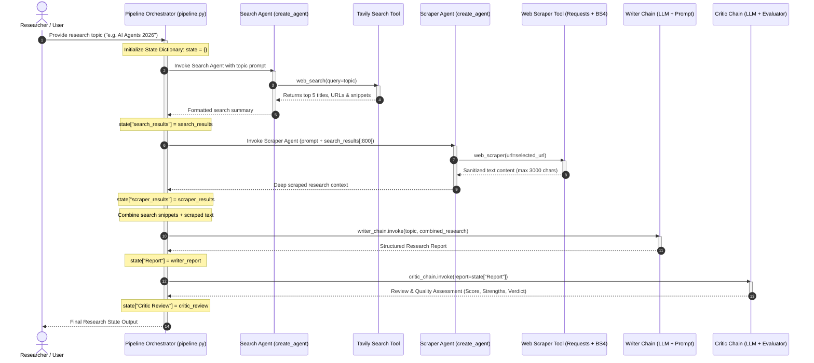
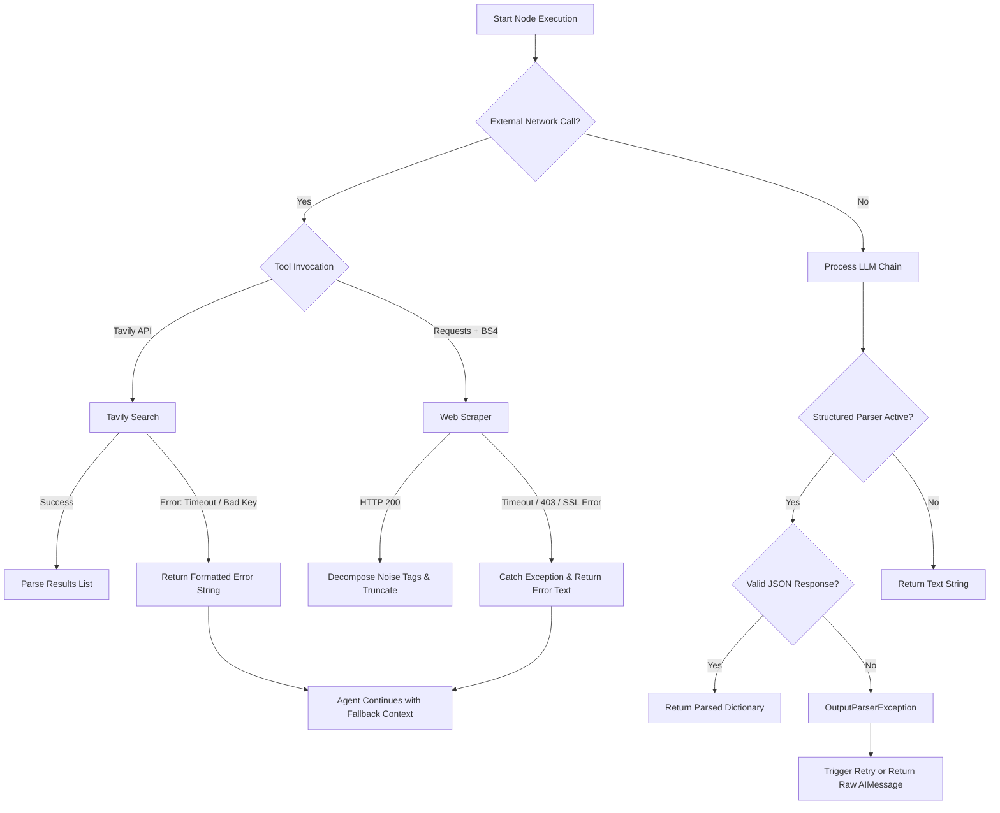

# 🔄 Multi-Agent System Architecture & Data Flow (`FLOW.md`)

This document details the internal mechanics, sequential progression, state management lifecycle, and message passing protocols governing the Multi-Agent Research and Critique system.

---

## 🧭 End-to-End Workflow Diagram



---

## 📦 State Transition Lifecycle

The pipeline maintains an execution context dictionary (`state: dict`) which accumulates data through each step:

```
[Initial Input]
      │
      ▼
┌────────────────────────────────────────────────────────┐
│ State Initial:                                         │
│ {}                                                     │
└────────────────────────────────────────────────────────┘
      │
      ▼ (Step 1: Search Agent)
┌────────────────────────────────────────────────────────┐
│ state["search_results"]                                │
│   - Multi-line string with Title, URL, and Snippet     │
│   - Fetched via Tavily API (5 results)                 │
└────────────────────────────────────────────────────────┘
      │
      ▼ (Step 2: Scraper Agent)
┌────────────────────────────────────────────────────────┐
│ state["scraper_results"]                               │
│   - Detailed textual extraction from best candidate URL│
│   - Cleaned of scripts, styles, navigations, footers   │
│   - Capped at 3,000 characters to prevent overflow     │
└────────────────────────────────────────────────────────┘
      │
      ▼ (Step 3: Writer Chain)
┌────────────────────────────────────────────────────────┐
│ state["Report"]                                        │
│   - Baseline: Markdown string                          │
│   - Structured: Dictionary with keys:                  │
│       - introduction                                   │
│       - key_findings (bullet list)                     │
│       - conclusion                                     │
│       - sources (URL list)                             │
└────────────────────────────────────────────────────────┘
      │
      ▼ (Step 4: Critic Chain)
┌────────────────────────────────────────────────────────┐
│ state["Critic Review"]                                 │
│   - Baseline: Formatted markdown string                │
│   - Structured: Dictionary with keys:                  │
│       - score (e.g. "8.5/10")                          │
│       - strengths (bullet list)                        │
│       - areas_to_improve (bullet list)                 │
│       - verdict (one-line summary)                     │
└────────────────────────────────────────────────────────┘
```

---

## 🔬 Detailed Step Breakdown

### Step 1: Search Agent Execution
- **Trigger**: `pipeline.py` calls `build_search_agent().invoke(...)`.
- **Model**: `ChatGoogleGenerativeAI(model="gemini-3.6-flash", temperature=0)`.
- **Tool Bound**: `web_search(query: str)`.
- **Internal Action**:
  1. The LLM processes the human message requesting information on `{topic}`.
  2. The LLM generates a tool call to `web_search` with an optimized query.
  3. `web_search` executes `tavily_client.search(query, max_results=5)`.
  4. Formats each entry into `Title`, `URL`, and `Snippet` (first 300 chars).
  5. The model synthesizes the tool response and yields the final response in `search_results["messages"][-1].content`.

### Step 2: Scraper Agent Execution
- **Trigger**: `pipeline.py` calls `build_scraper_agent().invoke(...)`.
- **Input Context**: Topic prompt + truncated search results (`state['search_results'][:800]`).
- **Tool Bound**: `web_scraper(url: str)`.
- **Internal Action**:
  1. Scraper Agent inspects URLs provided in the search results context.
  2. Autonomously selects the most authoritative and relevant source URL.
  3. Invokes `web_scraper(url=selected_url)`.
  4. `web_scraper` issues an HTTP GET with a realistic browser User-Agent (`Mozilla/5.0`) and `verify=False` to bypass SSL certificate issues.
  5. BeautifulSoup parses the HTML tree and completely deletes noise tags:
     ```python
     for tag in soup(["script", "style", "header", "footer", "nav", "aside"]):
         tag.decompose()
     ```
  6. Returns sanitized plain text up to 3,000 characters.
  7. The agent captures the extracted body and stores it in `state["scraper_results"]`.

### Step 3: Writer Chain Synthesis
- **Trigger**: `writer_chain.invoke({"topic": topic, "research": combined_research})`.
- **Context Synthesis**:
  ```python
  combined_research = (
      f"Search Results:\n{state['search_results']}\n\n"
      f"Scraper Results:\n{state['scraper_results']}"
  )
  ```
- **Prompt Structure**:
  - Directs model to act as an expert research writer.
  - Requires: Introduction, Key Findings (≥ 3 points), Conclusion, and full URL Sources list.
- **Variant Processing**:
  - **In `agents.py`**: Direct prompt-to-model LCEL pipe: `writer_prompt | llm`. Returns raw markdown string.
  - **In `claude/agents.py`**: Appends `StructuredOutputParser`: `writer_prompt | llm | report_parser`. Injects schema instructions into prompt and returns a validated dictionary.

### Step 4: Critic Chain Review
- **Trigger**: `critic_chain.invoke({"report": state["Report"]})`.
- **Prompt Structure**:
  - Mandates a strict, honest, and constructive evaluation rubric.
  - Evaluates clarity, factuality, depth, and citation integrity.
- **Output Rubric**:
  - **Score**: X / 10
  - **Strengths**: Bullet points highlighting core merits.
  - **Areas to Improve**: Constructive gaps and missing data points.
  - **Verdict**: Definitive one-line judgment.
- **Variant Processing**:
  - **Baseline**: Outputs formatted string directly to stdout.
  - **Structured**: Outputs schema-validated dictionary, allowing downstream systems to filter or alert based on score thresholds.

---

## 🛡️ Exception Handling & Fallback Strategy



### Edge Case Handlers
1. **Scraping Failures**: If a page blocks crawlers with 403 or times out (>10s), `web_scraper` catches the exception and returns `"An error occurred while scraping the webpage: <error>"`. The pipeline does not crash; the writer chain falls back to using Tavily search snippets.
2. **Context Window Protection**:
   - Tavily snippets are truncated to 300 characters each.
   - Scraper input is restricted to the first 800 characters of search output.
   - Scraped webpage body is capped at 3,000 characters.
   - Total context provided to Writer Chain remains comfortably under token limits.
3. **Structured Parser Guardrails**: When using `claude/pipeline.py`, prompts include formatting instructions with explicit schema keys, keeping output machine-readable.
